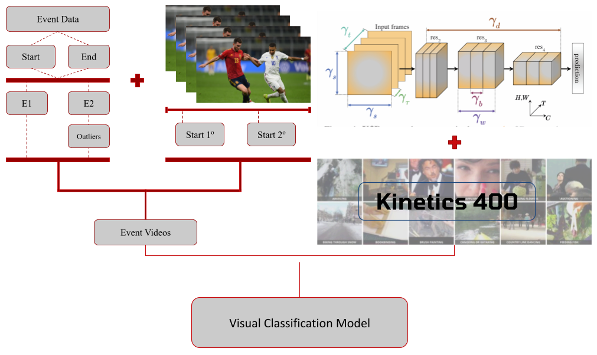

## SoccerEventSpotNet
[Gabriel R. Martins](https://github.com/GabrielRmartins)

[](LICENSE)

This repository is part of a soccer event automatic detection project. It offers all resources needed to setup an experimental environment for soccer event spotting task, since data collecting modules until usage examples notebooks.

Wanna quicky try on your soccer video? [Try this example](https://github.com/GabrielRmartins/SoccerEventSpotNet/blob/main/ExamplesNotebooks/minimal_inference_example.ipynb)

## Table of Contents

- [Introduction](#introduction)
- [Installation](#installation)
- [Usage](#usage)
  - [Inference](#inference)
  - [Data Collecting](#data)
  - [Video Collecting](#video)
  - [Data Processing](#processing)
  - [Training](#training)
  - [Evaluating](#evaluating)
- [Contribute](#contributing)
- [License](#license)

## Introduction
This repository contains official implementations developed for the Oriented Computation Project (POC) course offered by the [Computer Science Department of UFMG](https://dcc.ufmg.br/)

**Motivation.** As the popularity of data based analysis in sports rises among teams and enthusiasts, the need of high-quality data to support becomes an important task. The impact os this necessity has created a new soccer data industry environment where companies provide these resources/data as their main product. One of the used type of data in this context is **event data**, that says:for each event occurence during a soccer match, what are its atributes such as player who performed it and its  type. Considering the high demand and limited sources of this kind of data, why not obtain it automatically from matches videos? This project aims to automatically detect a portion of this data, generating an automated tool for event type detection from videos.

**Objective.** The main porpouse of this project is to use event data information, specially event types and timestamps, to automatically generate video-label pairs that could be used to train an video classifier model, in this case, perform a fine-tuning on X3D-S pre-trained on Kinetics-400.

**Collected Data.** Wyscout top 5 public events dataset is the main source of tabular data needed during this project. It provides events information from European Top 5 five leagues 2017-2018 season matches and also 2016 Uefa EuroCup and 2018 Fifa WorldCup. This dataset was proposed at [A public data set of spatio-temporal match events in soccer competitions](https://www.nature.com/articles/s41597-019-0247-7).

**Collected Video.** All video were collected from YouTube official teams and competitions channels, filtering matches with reference on Wyscout Top 5 dataset. At the end, 55 full matches videos were colected and its references are on Common module of this repository.

**Project Pipeline.** 



## Installation

This project has several dependecies. In order to use it, it's higly recommended to create a virtual environment to this project. 
If you use Linux and conda, just create a new env with:

```bash
git clone https://github.com/GabrielRmartins/SoccerEventSpotNet.git
cd SoccerEventSpotNet

#Create conda env
conda env create -f environment.yml
conda activate LinuxEnv
```

It's recommended using GPU resources during training and evaluating modules, but if it's not available you can use CPU only. If using GPU watch ou cuda version installed with torch lib, if necessary check pytorch website for most suitable version to your gpu.

## Usage

### Inference

To run any model on a video, you should use minimal_inference_example notebook available at ExamplesNotebooks module, just change the video path, the model checkpoint path and labels folder path. A quick example is available by just running the provided paths. Running other models from project experiments is possible by changing its path, but it's necessary to generate its experiment labels.

### Data Collecting

To collect tabular data used on this project from Wyscout Top 5 dataset available at [Figshare](https://figshare.com/collections/Soccer_match_event_dataset/4415000/2) you should use EventCollector module:
```bash
cd EventCollector

python event_downloader.py --output_path <output_path> --url_events <url_events> --url_matches <url_matches> --url_teams <url_teams> 
```

Where:

- output_path: is an optional parameter that defines the desidered data output path (default is "SoccerEventSpotNet/Common").

- url_events: in an optional parameter that defines the url to download events data from (default is "https://figshare.com/ndownloader/files/14464685").

- url_matches: in an optional parameter that defines the url to download matches data from (default is "https://figshare.com/ndownloader/files/14464622").

- url_teams: in an optional parameter that defines the url to download teams data from (default is "https://figshare.com/ndownloader/files/15073697").


### Video Collecting
To collect videos from matches with reference on tabular data you should use VideoCollector module:

```bash
cd VideoCollector

python video_downloader.py --output_path <output_path> --input_path <input_path> --options_path <options_path>"
```

Where:

- output_path: folder or path where videos will be saved.
(default: "SoccerEventSpotNet/Common/Videos")

- input_path: path to the .csv file containing the match list.
(default: "SoccerEventSpotNet/Common/MatchesInfo.csv")

- options_path: path to a .json file with yt_dlp download options.
(default: "SoccerEventSpotNet/VideoCollector/DownloadOptions.json") 

### Processing
To process all collected data, you should DataProcessing module scripts:
```bash
cd DataProcessing
```
It's recommended to run them at this order: process_events **->** split_matches **->** generate_labels **->** generate_tensors.  

**Processing events.**
```bash
python process_events.py --events_data_path <events_data_path> --video_info_path <video_info_path> --output_path <output_path>  
```
Where:
- events_data_path is the path to event data folder downloaded by EventCollector module (Default is "SoccerEventSpotNet/Common/WyscoutTop5/events")
- video_info_path is the path for matches_info file provided on Common module.(Default in "SoccerEventSpotNet/Common/MatchesInfo.csv")
 - output_path is the desired path where processed events DataFrame should be saved.(Default is "SoccerEventSpotNet/Common/PrecessedEvents.csv")

**Note**: you can ignore passing these parameters if you use project default strucure on previous modules.

**Spliting Matches.**
```bash
python split_matches.py --output_path <output_path> --events_data_path <events_data_path> 
```
where:
- output_path is the path of output folder desired for generated matches split into train(60%), test(%20) and validation(20%).(Default is "SoccerEventSpotNet/DataProcessing/MatchesSplit.json")       
- events_data_path is the path to processed events data file (.csv).(Default is "SoccerEventSpotNet/Common/ProcessedEvents.csv")
        

Note: You can ignore the parameters if you used default paths on previous modules.

**Generating labels.**
```bash
python generate_labels.py --events_data_path <events_data_path> --output_path <output_path> --exp_id <exp_id> --matches_split_path <matches_split_path>
```

Where:
- events_data_path is the path to processed event data (.csv).(Default is "SoccerEventSpotNet/Common/ProcessedEvents.csv")
- output_path is the path to the output folder where labels should be saved.(Default is "SoccerEventSpotNet/Common/Labels/")
 - exp_id is the experiment identifier from where labels should be created.(Default is "1", possible entries: 1-12)
- mathes_plit_path is the path to file with spliting json dictionary.(Default is "SoccerEventSpotNet/DataProcessing/MatchesSplit.json")
    
Notes:

-  The labels will be generated on outpuh_path folder inside a new folder of name "Exp_{exp_id}".
- If you want to create new labels you should modify "DataProcessing/generate_labels.py" to generate these labels. One way to do it is to implement a new generation function and an "elif" new statement on "main" function that call it with a specific identifier.

**Generating tensors.**
```bash
python generate_tensors.py --output_path <output_path> --video_data_path <video_data_path> --events_data_path <events_data_path> --video_info_path <video_info_path> --seg_strategy <seg_strategy>
```
Where:
- output_path is the path to the folder where generated tensors should be saved.(Default is "SoccerEventSpotNet/Common/Tensors")
- video_data_path is the path of the folder with matches videos(.mp4)(Default is "SoccerEventSpotNet/Common/Videos")
- events_data_path is the path to processed event data DataFrame.(Default is "SoccerEventSpotNet/Common/ProcessedEvents.csv")
- video_info_path is the path to file with collected matches info.(Default is "SoccerEventSpotNet/Common/MatchesInfo.csv")
- seg_strategy is the identifier for segmentation strategy that should be using during tensors generation.( Default is '1', possible entries: 1,2)

Notes: 
 - You can ignore the parameters if you used default paths on previous modules.
- The .h5 file name generated will be "tensors_strategy_<seg_strategy>.5"
- If yout want to implement a new segmentation strategy you should create a new function on ¨DataProcessing/utils.py" that generates timestamps for each event and add a path ot it on "DataProcessing/generate_tensor.py", for example, you can implement a new strategy 3 and call it with --seg_strategy '3' if you generate these functions and add an additional "elif" statement to the new function.


### Training
In order to train new models, you need a h5py file with preprocessed tensors and new labelsm an example of this process is available at ExamplesNotebooks module on training_example script. Considering you have these resources, you can run it with:
```bash
cd ModelTraining

python train_model.py --h5_path <h5_path>  --labels_path <labels_path> --output_path <output_path> --batch_size <batch_size>
```
Where:
- h5_path is the path to h5 file with processed tensors.(Default is "SoccerEventSpotNet/Common/Tensors/tensors_strategy_1.5")
- labels_path is the path to processed labels folder.(Default is "SoccerEventSpotNet/Common/Labels/Exp1_1")
 - output_path is the desired output folder to save training checkpoints. (Default is "SoccerEventSpotNet/ModelTraining/Checkpoints")

Notes: 
- This training module implements a fine-tune on X3D-S arquitecture pre-trained on Kinetics 400, 
        in order to train all model you should change model import param "pre-trained" to False. Changing 
        model arquitecture may change model input shape, so be aware about models hyperparams before trying it.
- In order to train Exp_5 models you should run this script using the unique labels for each folder defined during it's label generation.

### Evaluting
You can also use ModelTraining module scripts to evaluate your new model by giving it's checkpoint path and labels path with:
```bash
python evaluate.py --h5_path <h5_path>  --labels_path <labels_path> --output_path <output_path> --batch_size <batch_size> --num_frames <num_frames> --model_path <model_path>
```
where:
- h5_path is the path to h5 file with processed tensors.
        (Default is "SoccerEventSpotNet/Common/Tensors/tensors_strategy_1.5")
- labels_path is the path to processed labels folder.
        (Default is "SoccerEventSpotNet/Common/Labels/Exp1_1")
- output_path is the desired output folder to save training checkpoints. 
        (Default is "SoccerEventSpotNet/ModelTraining/Checkpoints")
- model_path is the path to the model that should be evaluated.
        (Default is None)
- batch_size is the size of processing batch during model infering.
        (Default is 8)
-num_frames is the number of frames per video saved on tensor.
        (Default is the same as X3D_S pre-trained = 13 )

## Contribute

You are free to contribute in any aspect of this project. Some of interesting directions should be collecting new video-label pair, scecially for less representative classes. Using new segmentation strategies could also help by testing how different strategies can create better quality video tensors. Adapting the pipeline to othes visual architetures could also be an amazing way to contribute on this project, evalutaing the impact of other classifiers on event detection performance.

## License
[](LICENSE)